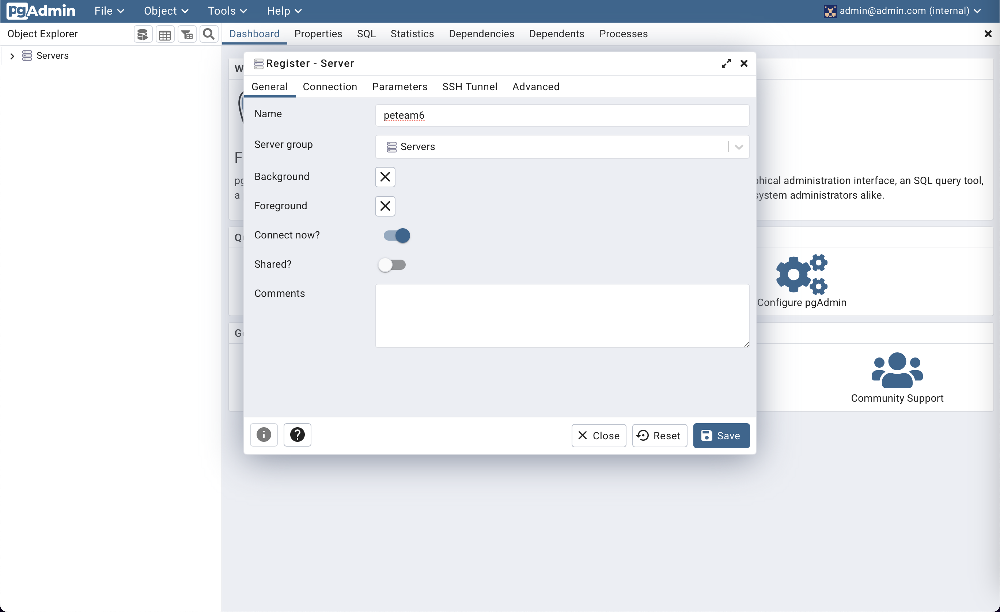
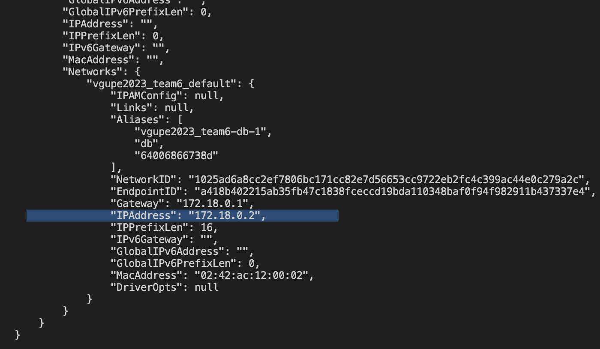
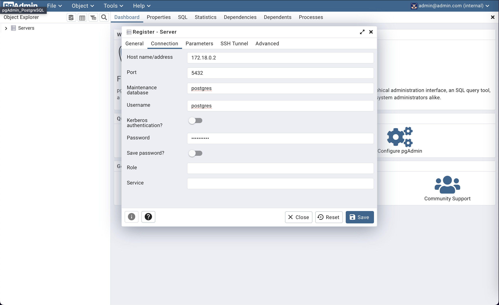
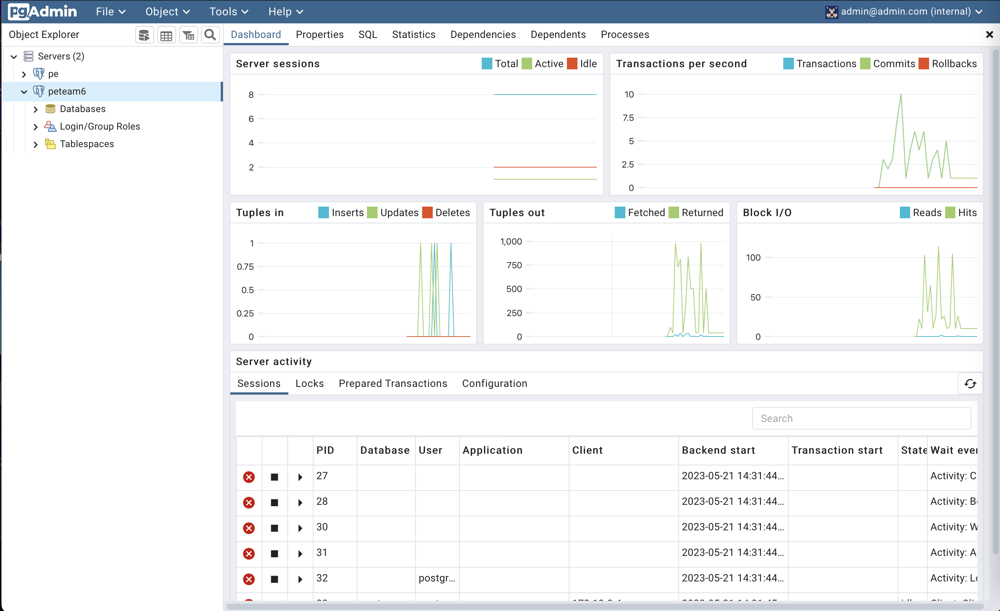

# How to run PostgreSQL & PgAdmin in using Docker 

Once you are on the main page, you have to create a connection with the ***postgres*** server. In order to do so, just click on ***Add New Server*** and a new dialog window will show up. There you must fill in 2 mandatory fields:

As indicated in the following picture, a ***Name*** to identify the connection to our **PostgreSQL** server must be provided. In our case we have selected ***my-postgres.***

The second required value is Host name/address and it is located on the form under the tab Connection. The value to input is 172.18.0.2 in our case. This value can be obtained by using the command docker inspect from the terminal (this command with the -f option provides us with the networking parameters in JSON format of the container my-own-postgres). Check the output and write down the value of the key IPAddress, so you can use it for the input Host name/address.

Once filled in the field Host name/address, you just need to input postgres for the user field and the password used when running the PostgreSQL in the step one (if you have followed the guide this value should be postgresmaster).The form should look like the picture below:

Finally click on Save and the connection to your postgres instance will appear on the left side menu. From there you can fully manage the postgres instance running on the container.

